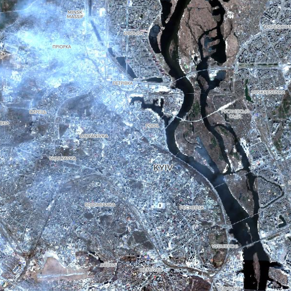

### [КОСМОС НЕ МОЖЕТ ЛГАТЬ](https://spacecantlie.github.io/spacecantlie/)

Спутники дистанционного зондирования Земли - это не журналисты и не политики, у них нет политических, национальных, религиозных или иных предпочтений. Единственная задача таких спутников - беспристрастно наблюдать. Посмотрите как изменились города Украины после 24 февраля 2022 года на спутниковых снимках Sentinel-2.

Проверить достоверность информации размещенной на сайте может любой желающий, исходные данные доступны для скачивания на сайте программы Copernicus, Европейского космического агенства.

  

